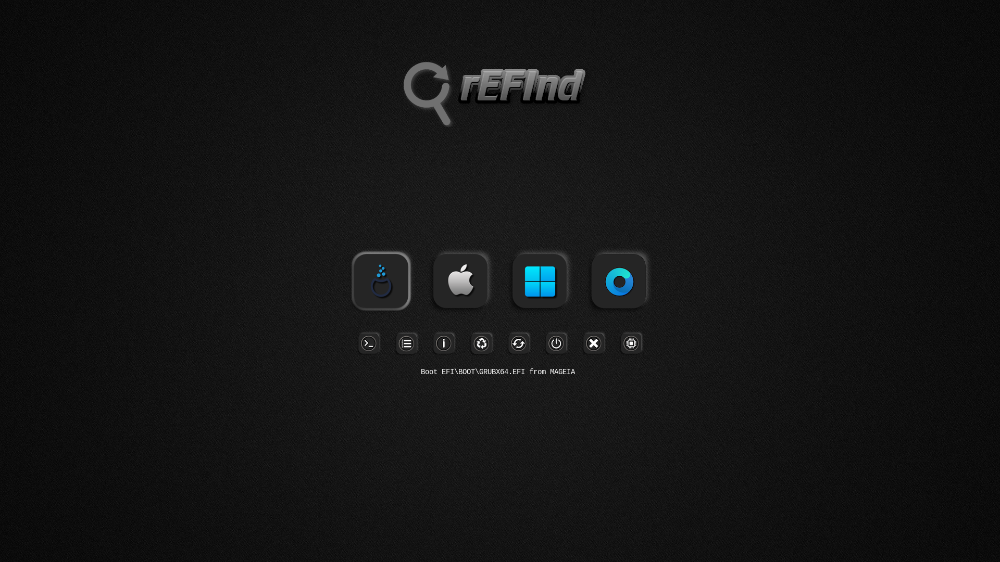
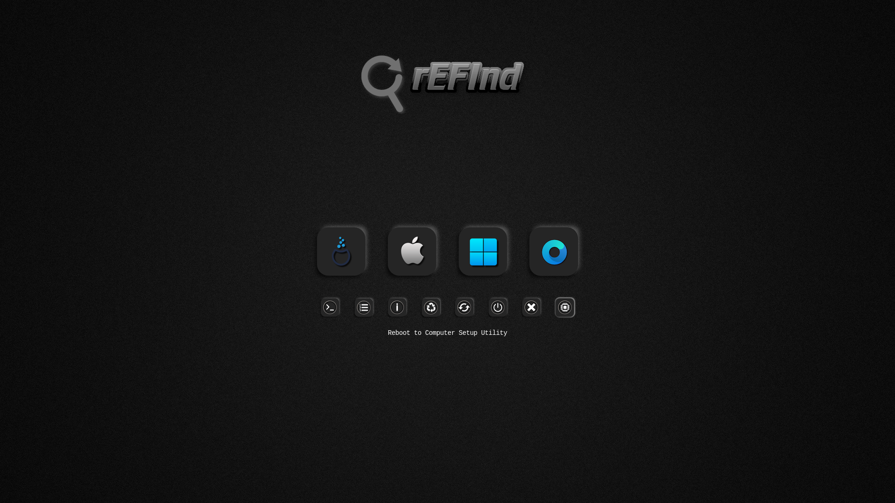
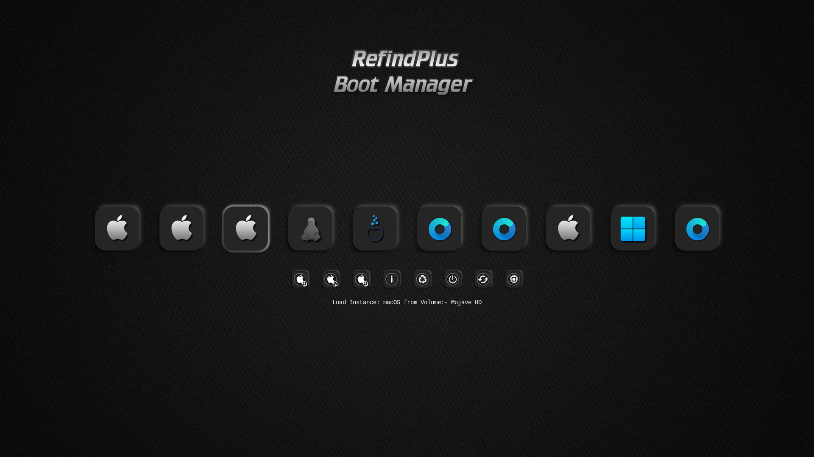
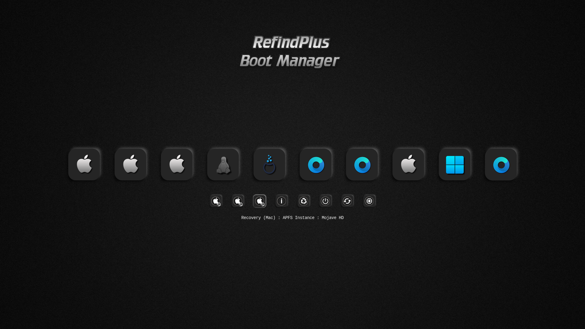

# rEFInd-Shadow-IOS

- Icon Set use with [rEFInd](https://www.rodsbooks.com/refind/) and  [rEFIndPlus](https://github.com/dakanji/RefindPlus)
  
- ### 92 Distro Icons

View ➤ [Ison Set](https://github.com/chris1111/rEFInd-Shadow-IOS/blob/main/View-Set.md)
View ➤ [All Icons](https://github.com/chris1111/rEFInd-Shadow-IOS/tree/main/rEFInd-Shadow-IOS)

Configuration ➤ [Refind config](https://github.com/chris1111/rEFInd-Shadow-IOS/blob/main/rEFInd-Shadow-IOS-Refind.conf)

Download Icons Set ➤ [rEFInd-Shadow-IOS.zip](https://github.com/chris1111/rEFInd-Shadow-IOS/raw/refs/heads/main/rEFInd-Shadow-IOS.zip)

View Site ➤ [rEFInd-Shadow-IOS](https://chris1111.github.io/rEFInd-Shadow-IOS/)

### rEFInd

### rEFIndPlus

My Other theme ⬇︎

[Shadow-rEFInd](https://github.com/chris1111/Shadow-rEFInd)

[rEFInd-Metal-Frame](https://github.com/chris1111/rEFInd-Metal-Frame) 

[Icon-Set-DarkGrey-Refind](https://github.com/chris1111/Icon-Set-DarkGrey-Refind)
